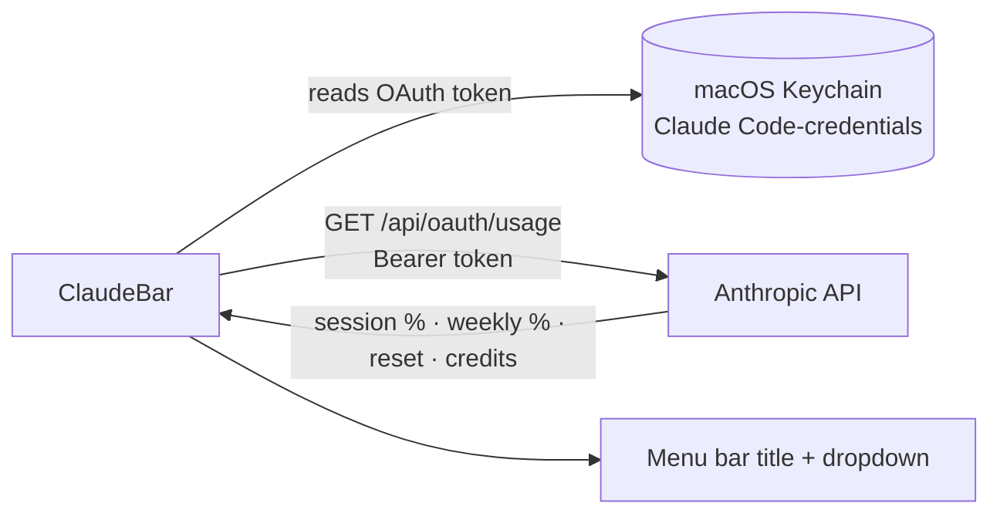

# ClaudeBar — Claude usage in your macOS menu bar

**ClaudeBar** is a lightweight, native **macOS menu bar app** that shows your
**live Claude usage** at a glance: your **current session percentage**, **weekly
limits**, **reset times**, and **extra-usage credits** — the exact same numbers
as the official Claude usage console, right in your status bar.

Built for developers using **Claude Code**, **Claude Pro**, **Claude Max**, and
**Claude Team** who want to keep an eye on their **rate limits** without opening
a browser tab.


---

## Preview

```
 menu bar ▸   8% · 4h47m

 ┌─────────────────────────────────────────────┐
 │  Sessione corrente                          │
 │    8% utilizzato · reset tra 4h 47m (17:39) │
 │  ──────────────────────────────────────────│
 │  Limiti settimanali                         │
 │    Tutti i modelli: 41% · reset lun 02:59   │  ← active limit in bold
 │    Sonnet: 24% · reset lun 02:59            │
 │  ──────────────────────────────────────────│
 │  Crediti extra                              │
 │    €90,01 / €150,00 (60%)                   │
 │  ──────────────────────────────────────────│
 │  Aggiornato 12:52:52                        │
 │  Aggiorna ora    ⌘R                         │
 │  ✓ Avvia al login                           │
 │  Esci            ⌘Q                         │
 └─────────────────────────────────────────────┘
```

The menu-bar title shows `current session % · time until reset`. Click it for
the full breakdown.

---

## Features

- **Live session usage** — current 5-hour session percentage and a countdown to
  the reset, ticking locally every 30 seconds.
- **Weekly limits** — "all models" and per-model (e.g. Sonnet) weekly usage with
  their reset day/time; the currently active limit is highlighted.
- **Extra-usage credits** — your monthly credit spend in your billing currency
  (e.g. `€90.01 / €150.00`).
- **Color-coded at a glance** — a tinted dot and percentage in the bar: 🟢 ≤64 ·
  🟡 65–84 · 🔴 ≥85.
- **Threshold notifications** — optional macOS notification when any limit crosses
  your alert threshold (default 85%), once per reset window.
- **Choose what the bar shows** — current session, top weekly limit, or
  automatic (whichever is most binding).
- **Exact console parity** — reads the same authenticated endpoint the Claude
  console uses, so the numbers always match.
- **Gentle on the API** — fetches at most once every few minutes (configurable),
  ticks the countdown locally in between, refreshes on wake/network return, and
  backs off automatically on HTTP 429 (honoring `Retry-After`).
- **Native & tiny** — a single Swift binary for Apple Silicon, **zero
  dependencies**, no Electron, negligible memory and CPU.
- **Private by design** — reads your token from the macOS Keychain at runtime
  and talks only to Anthropic's API. Nothing is logged or sent anywhere else.
- **Preferences in the menu** — bar metric, notifications, alert threshold,
  refresh interval, launch at login, and a quick link to the usage console.

---

## Why ClaudeBar (and how it differs from ccusage)

Tools like [`ccusage`](https://github.com/ryoppippi/ccusage) read your local
transcript logs in `~/.claude/projects/**/*.jsonl` and **estimate** usage from
token counts. That's great for cost analysis, but those logs contain only token
counts — **the console's real percentages are not derivable from them**, so a
token-log estimator can't match the official "you've used X%" numbers.

ClaudeBar takes the other approach: it reads the **same authenticated usage
endpoint the Claude console itself uses**, so what you see in the menu bar is
exactly what you'd see in the console — no estimation, no drift.

| | Token-log estimators (ccusage-style) | **ClaudeBar** |
|---|---|---|
| Data source | local JSONL token logs | official `api/oauth/usage` |
| Session / weekly % | estimated | **exact (console parity)** |
| Reset times | inferred | **authoritative** |
| Extra-usage credits (€/$) | ✗ | **✓** |
| Dollar cost estimate | ✓ | ✗ (shows plan %, not $ per token) |

Use ccusage for per-project token/cost accounting; use ClaudeBar to mirror your
plan limits live.

---

## How it works



1. Reads the Claude Code OAuth token from the macOS Keychain (generic password,
   service `Claude Code-credentials`).
2. Calls `GET https://api.anthropic.com/api/oauth/usage` with that token.
3. Renders session/weekly limits, reset times, and credits in the menu bar.

The token is re-read from the Keychain on every fetch, so it stays valid as long
as you use Claude Code (which refreshes it). If it expires, ClaudeBar shows
`⚠︎ login` — just reopen Claude Code to refresh it.

---

## Requirements

- **macOS 13 (Ventura) or later** — tested on Apple Silicon.
- **Swift toolchain** — the Xcode Command Line Tools are enough
  (`swift --version`).
- **Claude Code** installed and logged in (so the OAuth token is in your
  Keychain).

---

## Installation

### Homebrew (recommended)

```bash
brew install --cask tozzilla/claudebar/claudebar
open /Applications/ClaudeBar.app
```

The cask installs the **signed and notarized** build, so it opens with no
Gatekeeper warnings.

### Download

Grab the notarized `ClaudeBar-<version>.zip` from the
[latest release](https://github.com/tozzilla/claudebar/releases/latest), unzip,
and move `ClaudeBar.app` to `/Applications`.

### Build from source

```bash
git clone https://github.com/tozzilla/claudebar.git
cd claudebar

# Build a standalone ClaudeBar.app
./build.sh

# Install and launch
cp -r ClaudeBar.app /Applications/
open /Applications/ClaudeBar.app
```

Then open the menu and enable **Avvia al login** ("Launch at login") to keep it
running.

For development you can run it in the foreground instead:

```bash
./init.sh            # build + run; Ctrl-C to stop
```

### First run: Keychain permission

The first time ClaudeBar reads your token, macOS may ask for permission to access
`Claude Code-credentials`. Click **"Always Allow"** — after that it reads the
token silently.

---

## Configuration

ClaudeBar works out of the box. To tweak it, edit and rebuild:

- **Refresh interval** — `fetchInterval` in `Sources/ClaudeBar/AppDelegate.swift`
  (default 180s; the endpoint updates roughly once a minute).
- **Countdown tick rate** — `tickInterval` (default 30s, network-free).
- **Menu-bar text** — `updateTitle()` in `AppDelegate.swift`.

### Debug / one-shot

```bash
.build/release/ClaudeBar --print   # fetch once, print the snapshot, exit
```

---

## Privacy & security

- The OAuth token never leaves your machine except in the `Authorization` header
  of the request to Anthropic's own API.
- The token is **not** stored in the app, the source, or the repository — it is
  read from the Keychain at runtime.
- No telemetry, no analytics, no third-party services.

---

## Rate limiting

The usage endpoint is designed for occasional refreshes (the console has a
manual refresh button). ClaudeBar therefore:

- fetches at most once every ~3 minutes,
- never fetches just because you opened the menu (it rebuilds from cache),
- ticks the reset countdown locally without hitting the network,
- and, on HTTP 429, backs off (using the `Retry-After` header) while continuing
  to display the last good data.

---

## FAQ

**Does this work with Claude Pro / Max / Team?**
Yes. It reads whatever plan limits the API returns for your account (session,
weekly, per-model, and credits where applicable).

**Why don't my numbers match `ccusage`?**
They measure different things. `ccusage` estimates from local token logs;
ClaudeBar reads the official usage endpoint. See
[Why ClaudeBar](#why-claudebar-and-how-it-differs-from-ccusage).

**It shows `⚠︎ login`.**
Your OAuth token expired. Open Claude Code to refresh it; ClaudeBar picks up the
new token automatically.

**It shows a 429 / rate-limit note.**
Too many requests in a short window. ClaudeBar backs off and recovers on its
own — no action needed.

**Does it need Xcode?**
No. The Command Line Tools provide everything (`swift build` links AppKit from
the macOS SDK).

---

## Tech

Swift + AppKit (`NSStatusItem`), built with Swift Package Manager into a native
arm64 binary, wrapped into a `LSUIElement` (agent) app bundle so it lives only in
the menu bar with no Dock icon. Launch-at-login via `SMAppService`.

## License

MIT — see [LICENSE](LICENSE).
